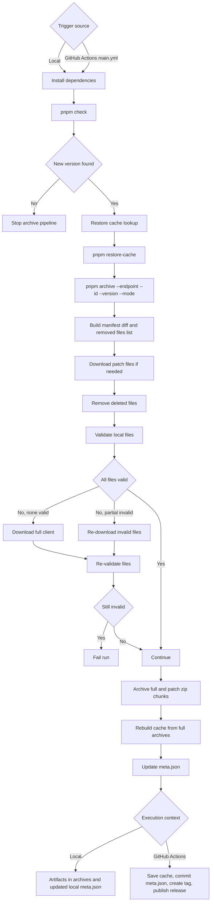

# PopKart Client Archive

A PopKart (Chinese KartRider) FRESH client archiver.

## Status

[](https://github.com/brownsugar/popkart-client-archive/actions/workflows/main.yml)

## What this project does

This project checks for new PopKart client versions, downloads changed files, validates local assets, and builds release archives.

Archives are published to the [Releases](https://github.com/brownsugar/popkart-client-archive/releases) page.

The scheduled archiving workflow runs at:

- 10:00 AM CST (weekdays)
- 10:00 PM CST (weekdays)

## Project structure

```text
.
|- src/
|  |- check.ts
|  |- archive.ts
|  |- restore-cache.ts
|  |- core/
|  `- lib/
|- tests/
|- client/
|- archives/
|- meta.json
`- server.json
```

- `src/check.ts`: checks remote patch info and tells you whether a new version exists.
- `src/archive.ts`: main pipeline entry; downloads files, validates files, creates archives, and updates `meta.json`.
- `src/restore-cache.ts`: restores cached full-client zip files into the local `client/` folder.
- `src/core/`: business logic modules (diff, downloader, validator, archiver, cache builder).
- `src/lib/`: shared helpers/utilities used across modules.
- `tests/`: Vitest test suites and fixtures.
- `client/`: local working client files used during validation and archiving.
- `archives/`: generated zip outputs for release publishing.
- `meta.json`: latest archived version metadata (version/id/timestamp).
- `server.json`: default socket host/port for patch lookup.

## Prerequisites

- Node.js 24.x
- pnpm 11.x
- Windows environment recommended (CI uses `windows-latest`)

## Setup

```bash
pnpm i
```

## Command reference

### Development and quality

- `pnpm lint`: run ESLint with autofix.
- `pnpm lint:types`: run TypeScript type checking
- `pnpm test`: run Vitest test suite.

### Archiver commands

- `pnpm check`: fetch latest patch info from socket; falls back to `TCG_SERVER_ENDPOINT` if configured.
- `pnpm restore-cache`: extract cached full client zips from `cache/` into `client/`.
- `pnpm archive --endpoint=... --id=... --version=... --mode=...`: run full archive pipeline.

## Environment variables

- `TCG_SERVER_ENDPOINT` (optional)
	- Used by `pnpm check` as fallback when direct socket check fails.

## Development and release flow



### Scenarios

1. No new version
	- `pnpm check` exits with no endpoint output.
	- The archive pipeline stops early.

2. New version with warm cache
	- Cached full-client zips are restored first.
	- Archive step usually downloads only changed patch files.

3. New version with cold cache
	- No cached full archives are available.
	- Pipeline continues; may download a full client when validation requires it.

4. Validation fallback path
	- If all files are invalid, full client download is triggered.
	- If only some files are invalid, only those files are re-downloaded.
	- If files remain invalid after retry, the run fails.

5. Local run output
	- `archives/*.zip` are generated locally.
	- `meta.json` is updated locally.

6. GitHub Actions release output (`.github/workflows/main.yml`)
	- Full-client cache is saved for future runs.
	- `meta.json` is committed to `main`.
	- Tag `P<version>` is created.
	- `archives/*.zip` are uploaded to GitHub Releases.

7. Pull request and branch checks (`.github/workflows/ci.yml`)
	- Runs quality checks only:
	- `pnpm lint`
	- `pnpm test`

## Output naming rules

### Notes

- Each generated zip is standalone and can be extracted independently.
- Large archives may be split into multiple chunks (`SequenceNumber` starts at `01`).

### Full files

```text
PopKart_Client_P{ClientVersion}_{SequenceNumber}.zip
```

### Patch files

```text
PopKart_Patch_P{PreviousVersion}_P{ClientVersion}_{SequenceNumber}.zip
```

## License

[GPLv3](LICENSE)
